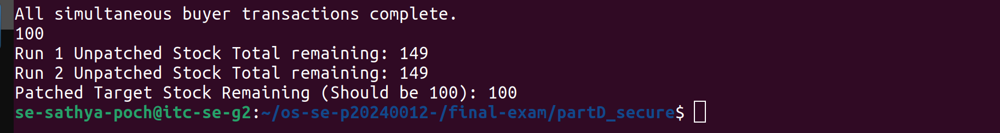
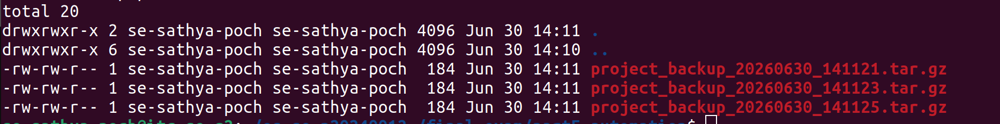

# Final Exam — <Your Name>

<!-- ===== COVER SHEET — required first section. Fill EVERY line. ===== -->
```
Student name: Poch Sathya
Student ID: p20240012
Server username: se-sathya-poch
Exam scenario value (COMPANY / PRODUCT): TechCorp
Date & start time: 30/6/2026 1:00 -3:00
AI assistant used (name/none): Chat gpt , gemini
```

> Exact commands per part are in `commands.md`. Live-curveball answers are in `live_mods.md`.
> Replace every `<...>` below. Keep answers tied to **your own** scenario numbers.

---

## Part A — Threads, Kernel Mapping & Signals

**Written (one short answer)**

- **Why does a worker thread's joined result reach the main thread, but a forked
  child's value would not?**

  Threads share memory with the main thread, so `pthread_join` can return the worker's result. A forked child has separate memory, so its changes do not directly affect the parent.

**Anything not completed:** none
---

## Part B — Files, Permissions & Special Bits

**Written (one short answer)**

- **Translate your private file's final octal mode into the 9-char symbolic string**
  (e.g. `600` → `rw-------`).

  octal `600` → `rw-------`

**Anything not completed:** none
---

## Part C — Bash Scripting, PATH & Safe File Scanning

**Written (one short answer)**

- **Why did `greeter` fail to run by name before you added your `bin` directory to
  PATH?**

  It failed because `~/bin` was not in `PATH`, so the shell could not find `greeter` by name.

**Anything not completed:** none

---

## Part D — Concurrency, a Race Condition & File Locking

**Screenshot**


s

**Written (one short answer)**

- **Why did the unpatched `swarm` sometimes leave more stock than the correct final
  value (with `150` stock and `50` concurrent buyers)?**

  Multiple buyers read the same stock value at the same time, so some updates overwrote others. This caused lost decrements and left extra stock.

**Anything not completed:** none

---

## Part E — Backups, Archiving & cron Automation

**Screenshot**



**Written (one short answer)**

- **Archiving vs compression — which one actually shrank the bytes, and why?**

  `tar` only bundles files together. `gzip` compression shrinks the bytes.

**Anything not completed:** none