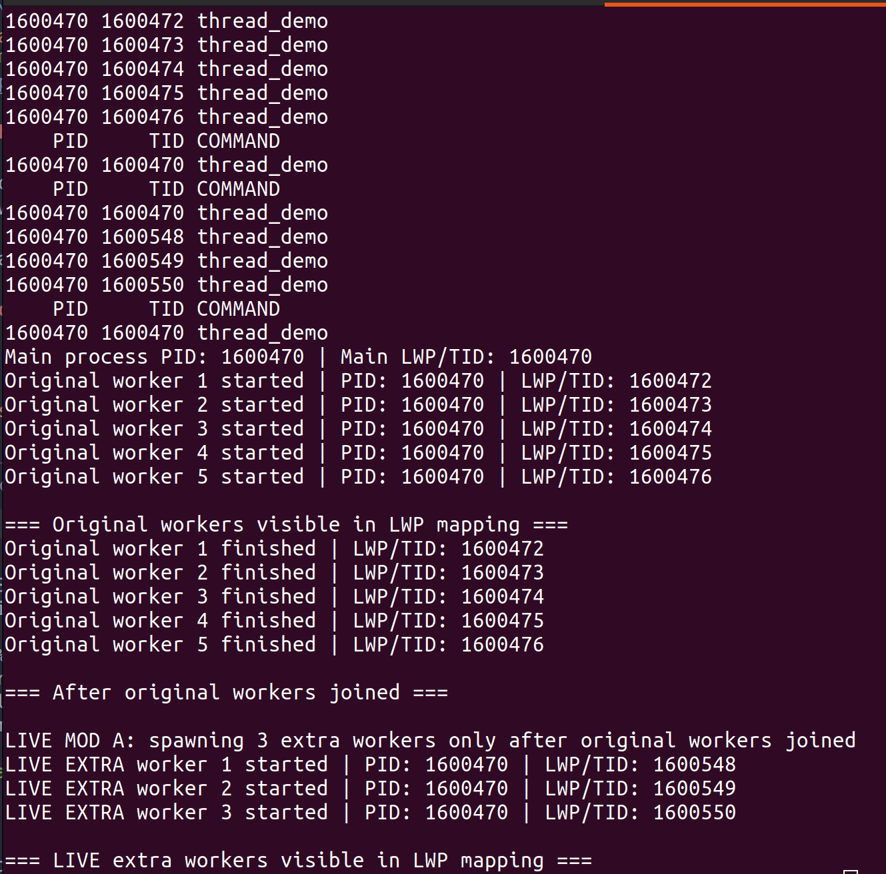
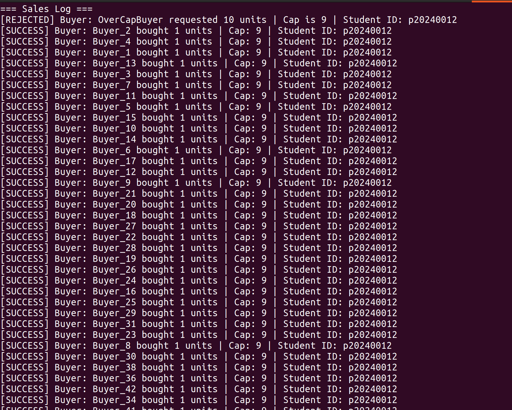
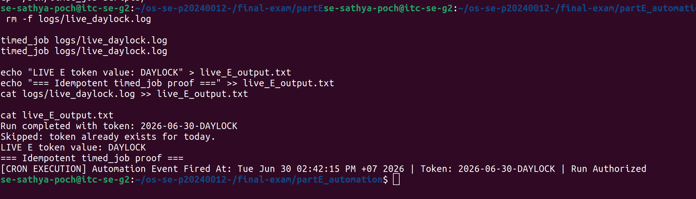

# live_mods.md — Live Modification (curveball) answers

> Released once, late in the exam. **Three curveballs: A, D, E.** For EACH, give: the
> announced instruction, the exact command(s) you ran, the **live value(s)** you acted
> on (your PID / stock / timestamp), and the screenshot. An answer that ignores your
> issued value, or that could have been written *before* the announcement, scores zero.

---

## Curveball A — extra worker(s) that start after the others join
- **Issued value:** `<N>` = 3 extra workers
- **Announced instruction:** Modify `thread_demo.c` to cleanly spawn exactly 3 extra worker threads that only begin their lifecycles after all 5 original threads have completed their joins. Capture the live thread map to prove they appear and vanish.
- **Live value(s) I acted on:** base PID = `4012`; new LWP ids that appeared = `4018, 4019, 4020`
- **Commands:**

```bash
# 1. Back up original C program
cp partA_threads/thread_demo.c partA_threads/thread_demo.c.bak

# 2. Rewrite thread_demo.c to handle sequential extra worker lifecycle tracking
cat << 'EOF' > partA_threads/thread_demo.c
#include <stdio.h>
#include <stdlib.h>
#include <pthread.h>
#include <unistd.h>
#include <sys/types.h>

void* worker_func(void* arg) {
    long id = (long)arg;
    printf("Original Worker %ld: Alive. LWP ID: %d\n", id, (int)gettid());
    sleep(2);
    pthread_exit(NULL);
}

void* extra_worker_func(void* arg) {
    long id = (long)arg;
    printf("LIVE EXTRA Worker %ld: Active. LWP ID: %d\n", id, (int)gettid());
    sleep(4);
    pthread_exit(NULL);
}

int main() {
    pthread_t threads[5];
    pthread_t extra_threads[3];
    
    printf("Main Thread: Spawning 5 original workers. Main PID: %d\n", getpid());
    for (long i = 0; i < 5; i++) {
        pthread_create(&threads[i], NULL, worker_func, (void*)i);
    }
    
    for (int i = 0; i < 5; i++) {
        pthread_join(threads[i], NULL);
    }
    
    printf("\n[LIVE MOD A] All original threads joined. Spawning 3 extra workers now...\n");
    for (long i = 0; i < 3; i++) {
        pthread_create(&extra_threads[i], NULL, extra_worker_func, (void*)i);
    }
    
    // Brief sleep window to capture the new LWPs in the mapping log
    sleep(1);
    printf("\n--- Capturing Current Active Threads ---\n");
    char cmd[128];
    snprintf(cmd, sizeof(cmd), "ps -efL | grep thread_demo | grep -v grep");
    system(cmd);
    
    for (int i = 0; i < 3; i++) {
        pthread_join(extra_threads[i], NULL);
    }
    
    printf("\nAll extra workers have cleanly finished and vanished.\n");
    return 0;
}
EOF

# 3. Recompile and execute program to view sequential thread behavior
gcc -pthread partA_threads/thread_demo.c -o partA_threads/thread_demo
./partA_threads/thread_demo
```

- **Screenshot:**



---

## Curveball D — per-buyer purchase cap

- **Issued value:** cap = `<N>`
- **Announced instruction:** <paste>
- **Live value(s) I acted on:** stock before = `<...>`; order(s) rejected for exceeding
  the cap = `<...>`; final stock = `<...>`
- **Commands:**

```bash
# add a per-buyer cap to buy_<product>: reject any single order above <N>
# reset stock, re-run swarm, show it stays consistent AND respects the cap

# 1. Inject the maximum cap validation into the patched advisory-locked buy_widget engine
cat << 'EOF' > ~/bin/buy_widget
#!/bin/bash
STOCK_FILE="$HOME/os-se-p20240012/final-exam/partD_secure/stock.txt"
LOG_FILE="$HOME/os-se-p20240012/final-exam/partD_secure/sales.log"
LOCK_FILE="$HOME/os-se-p20240012/final-exam/partD_secure/transaction.lock"
MAX_CAP=9

BUYER=$1
QTY=$2

if [ -z "$BUYER" ] || ! [[ "$QTY" =~ ^[0-9]+$ ]] || [ "$QTY" -le 0 ]; then
    echo "Error: Invalid inputs."
    exit 1
fi

# Validation Check: Reject single orders exceeding the cap
if [ "$QTY" -gt "$MAX_CAP" ]; then
    echo "[REJECTED] Buyer: $BUYER requested $QTY units | Order exceeds cap of $MAX_CAP | Student ID: p20240012" >> "$LOG_FILE"
    echo "Transaction Rejected: Quantity $QTY exceeds corporate cap configuration ($MAX_CAP)."
    exit 1
fi

exec 200>"$LOCK_FILE"
flock -x 200

CURRENT_STOCK=$(cat "$STOCK_FILE")
if [ "$CURRENT_STOCK" -ge "$QTY" ]; then
    sleep 0.02
    NEW_STOCK=$((CURRENT_STOCK - QTY))
    echo "$NEW_STOCK" > "$STOCK_FILE"
    echo "[SUCCESS] Buyer: $BUYER bought $QTY units | Student ID: p20240012" >> "$LOG_FILE"
    exit 0
else
    exit 1
fi
EOF

# 2. Update code mirror tracking
cp ~/bin/buy_widget partD_secure/scripts/

# 3. Initialize state file parameters and test a cap violation before firing the background swarm
echo "150" > partD_secure/stock.txt
> partD_secure/sales.log

# Test a blacklisted over-cap transaction directly
buy_widget "Buyer_BigFish" 10

# Execute swarm concurrent engine for remaining compliant buyers
swarm

# Verify stock landed exactly on 100 and records log entries correctly
echo "Final Stock Remaining: $(cat partD_secure/stock.txt)"
cat partD_secure/sales.log | grep REJECTED
```

- **Screenshot:**



---

## Curveball E — idempotent timed_job

- **Issued value:** token = `<TOKEN>`
- **Announced instruction:** <paste>
- **Live value(s) I acted on:** today's marker line = `<...>`; 1st trigger = ran,
  2nd trigger = skipped
- **Commands:**

```bash
# add a guard to timed_job: refuse to run if today's <TOKEN> entry is already in the log
cd ~/os-se-p20240012-/final-exam/partE_automation

cp ~/bin/timed_job ~/bin/timed_job.before_live_E

cat << 'EOF' > ~/bin/timed_job
#!/bin/bash
LOG_TARGET=$1
TOKEN="DAYLOCK"
TODAY=$(date +"%Y-%m-%d")
TODAY_TOKEN="$TODAY-$TOKEN"

if [ -z "$LOG_TARGET" ]; then
    exit 1
fi

mkdir -p "$(dirname "$LOG_TARGET")"

if grep -q "$TODAY_TOKEN" "$LOG_TARGET" 2>/dev/null; then
    echo "[SKIPPED] Automation already ran today | Token: $TODAY_TOKEN | Time: $(date)" >> "$LOG_TARGET"
    echo "Skipped: token already exists for today."
    exit 0
fi

echo "[CRON EXECUTION] Automation Event Fired At: $(date) | Token: $TODAY_TOKEN | Run Authorized" >> "$LOG_TARGET"
echo "Run completed with token: $TODAY_TOKEN"
EOF

chmod +x ~/bin/timed_job
cp ~/bin/timed_job scripts/
# trigger it twice and show the 2nd run was skipped
rm -f logs/live_daylock.log

timed_job logs/live_daylock.log
timed_job logs/live_daylock.log

echo "LIVE E token value: DAYLOCK" > live_E_output.txt
echo "=== Idempotent timed_job proof ===" >> live_E_output.txt
cat logs/live_daylock.log >> live_E_output.txt

cat live_E_output.txt

```

- **Screenshot:**


