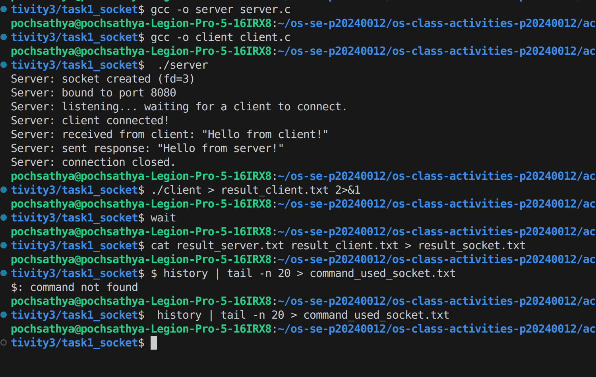
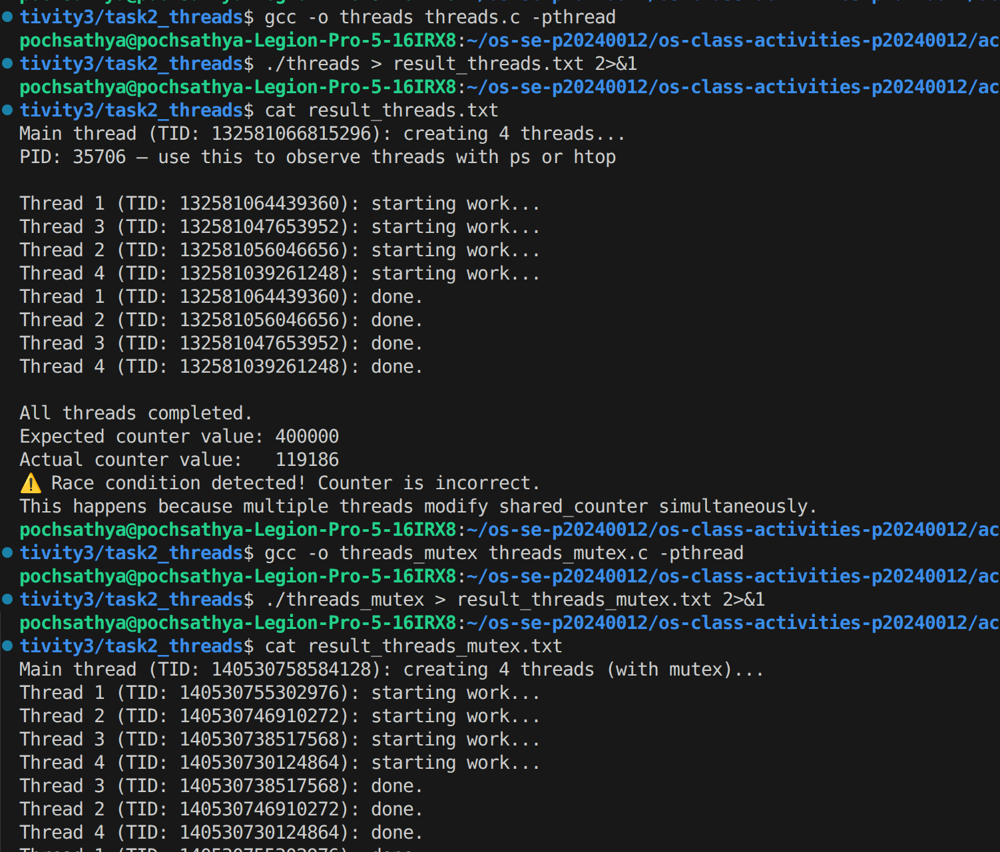
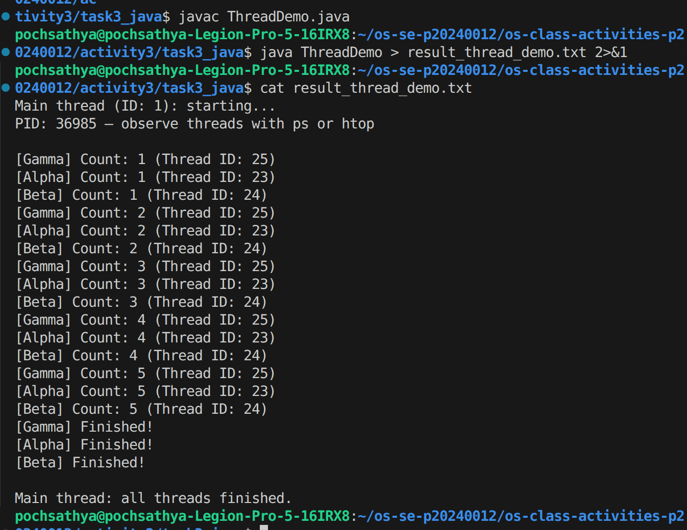
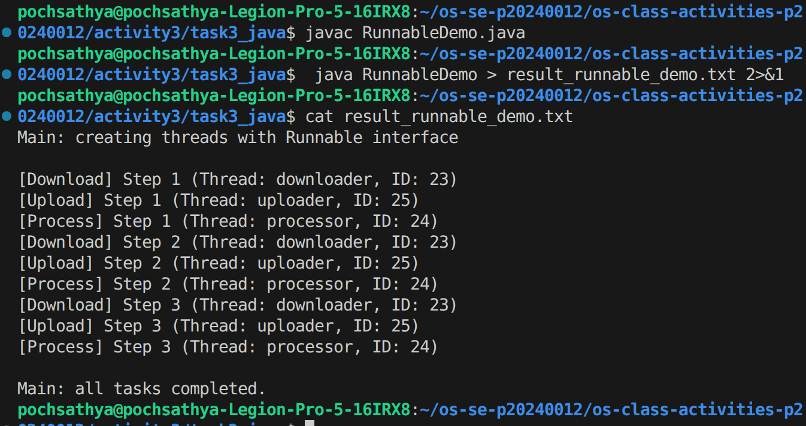
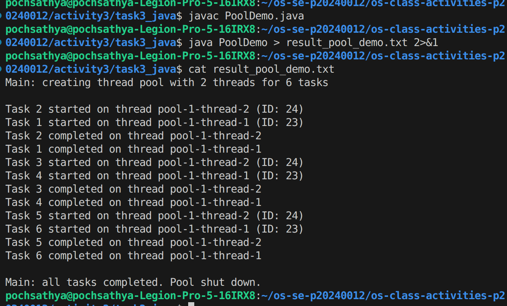
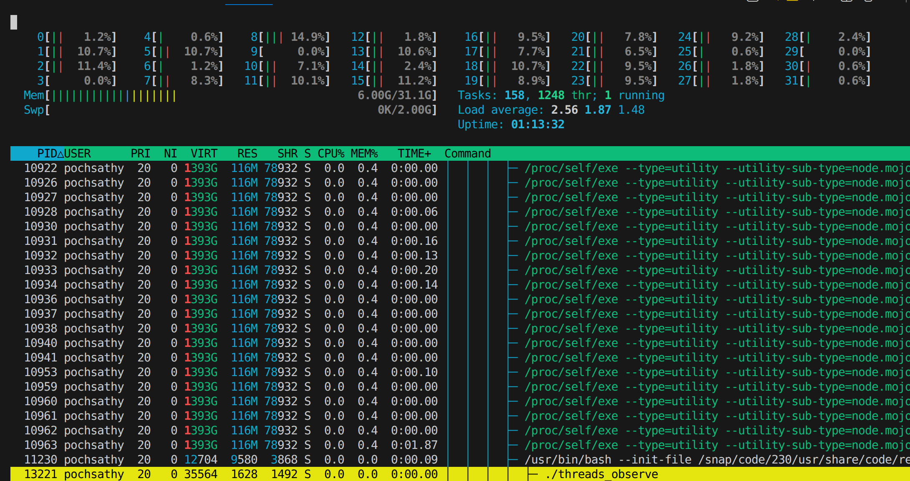

# Class Activity 3 — Socket Communication & Multithreading

- **Student Name:** Poch Sathya
- **Student ID:** p20240012
- **Date:** 02/04/2026

---

## Task 1: TCP Socket Communication (C)

### Compilation & Execution

### Answers

1. **Role of `bind()` / Why client doesn't call it:**
   > 

2. **What `accept()` returns:**
   > 

3. **Starting client before server:**
   > 
4. **What `htons()` does:**
   > 
5. **Socket call sequence diagram:**
   > 

---

## Task 2: POSIX Threads (C)

### Output — Without Mutex (Race Condition)

### Output — With Mutex (Correct)

### Answers

1. **What is a race condition?**
   > 

2. **What does `pthread_mutex_lock()` do?**
   > 
3. **Removing `pthread_join()`:**
   > 
4. **Thread vs Process:**
   > 
---

## Task 3: Java Multithreading

### ThreadDemo Output

### RunnableDemo Output

### PoolDemo Output

### Answers

1. **Thread vs Runnable:**
   > 

2. **Pool size limiting concurrency:**
   > 

3. **thread.join() in Java:**
   > 
4. **ExecutorService advantages:**
   

## Task 4: Observing Threads

### Linux — `ps -eLf` Output

_(Paste the relevant ps output here)_

### Linux — htop Thread View

### Windows — Task Manager

### Answers

1. **LWP column meaning:**
   > 

2. **/proc/PID/task/ count:**
   > 

3. **Extra Java threads:**
   > 

4. **Linux vs Windows thread viewing:**
   > 
---

## Reflection

> _What did you find most interesting about socket communication and threading? How does understanding threads at the OS level help you write better concurrent programs?_