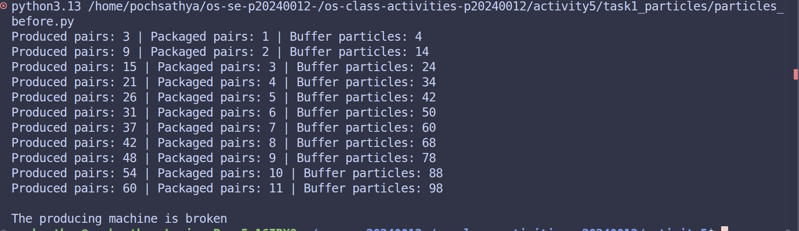
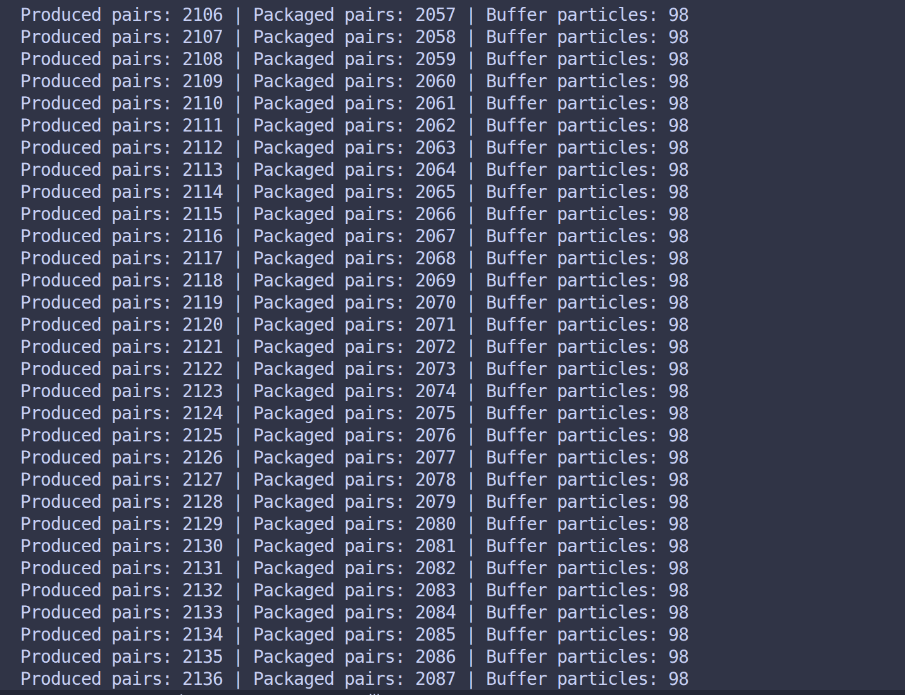
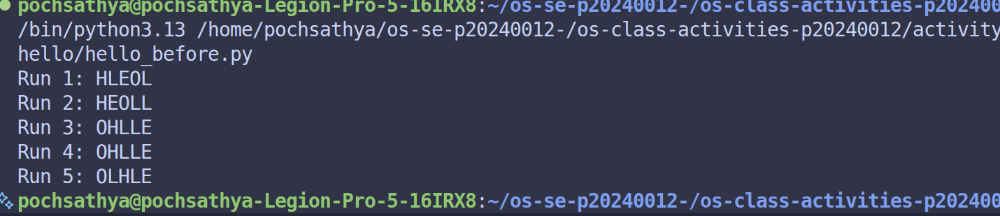
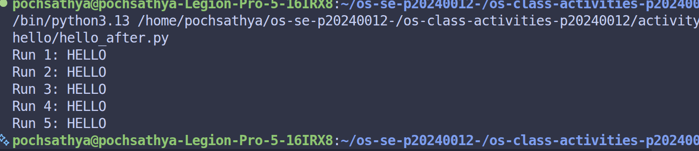

# Class Activity 5 - Semaphores

- **Student Name:** Poch Sathya
- **Student ID:** p20240012
- **Programming Language Used:** Python

---

## Task 1A: Particle Pair Buffer Before Semaphores

- What error or incorrect behavior appeared: Race Conditions
- Why did this happen without semaphore protection: Lack of mutual execution and signals 
---

## Task 1B: Particle Pair Buffer After Semaphores

- Number of producer machines: 3
- Buffer capacity: 4
- Semaphores used: mutex
- Produced pair count shown in screenshot: 2106-2136
- Packaged pair count shown in screenshot:2050-2087
- Did any error appear during normal operation? no 

---

## Task 2A: HELLO Before Semaphores

- Output before semaphore ordering: 
Run 1: HLEOL
Run 2: HEOLL
Run 3: OHLLE
Run 4: OHLLE
Run 5: OLHLE
- Why this output can be wrong or unpredictable: because of thread CPU Scheduling 

---

## Task 2B: HELLO After Semaphores

- Processes or threads used: 3 Threads
- Semaphores used: 4 binary semaphores
- Final output:
Run 1: HELLO
Run 2: HELLO
Run 3: HELLO
Run 4: HELLO
Run 5: HELLO

---

## Questions

1. In Task 1, why does a producer need to wait before adding a pair to the buffer?
The producer must wait if the buffer is full. If it doesn't, it will overwrite unread data and cause data loss. It blocks on an empty_slots semaphore until space opens up.
2. In Task 1, why does the consumer need to wait before removing a pair from the buffer?
The consumer must wait if the buffer is empty. If it doesn't, it will read duplicate or garbage data. It blocks on a full_slots semaphore until data is produced
3. Which semaphore protects the critical section in your particle buffer program?
A binary semaphore acting as a mtex usually initialized to 1 .
4. How does your program verify that `P1` and `P2` belong to the same pair?
The program verify that P1 and P2 belong to the same pair by packaging them together inside a single data structure alongside a shared unique identifier before pushing it to the buffer.
5. In Task 2, why can the program print letters in the wrong order without semaphores?
Because the CPU scheduler runs the concurrent threads unpredictably. Without synchronization, race conditions dictate which thread prints first, scrambling the output .
6. Which semaphore or synchronization step forces `H` to print before `E`, `L`, `L`, and `O`?
The semaphore for H is initialized to 1 , while all subsequent semaphores are initialized to 0. Each thread prints its letter and then calls .release() on the next thread's semaphore.
7. What could cause deadlock in either of your simulations?
Wrong lock order or a thread acquiring a semaphore but failing to release it due to a crash or missing code blocks all other waiting threads forever.

---

## Reflection

_What did these simulations teach you about using semaphores for shared resources and ordered execution?_
I learned to coordinates the execution order of processes using semaphores and use synchronization to manage access to shared resources in a multi-process.