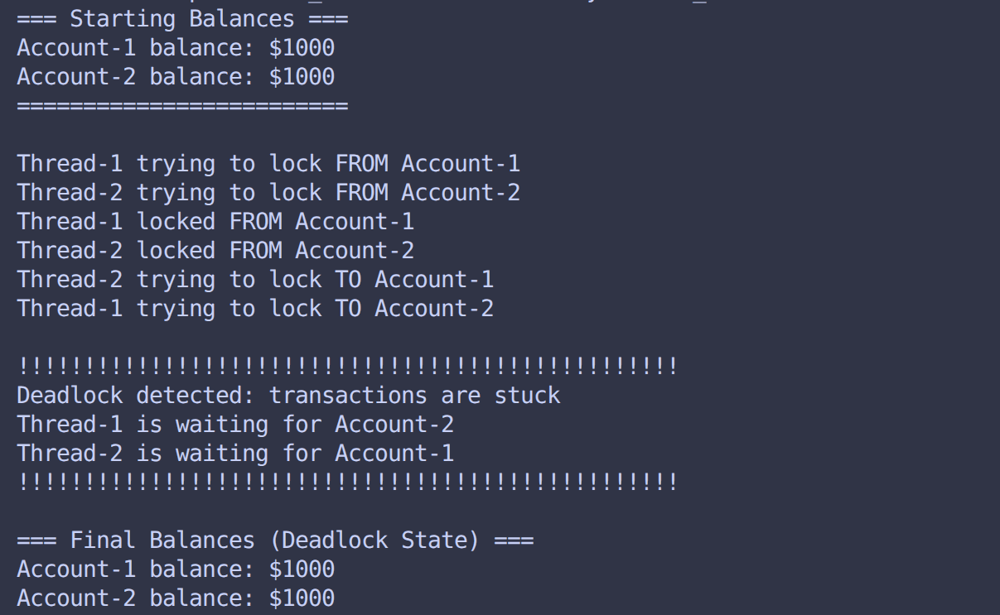
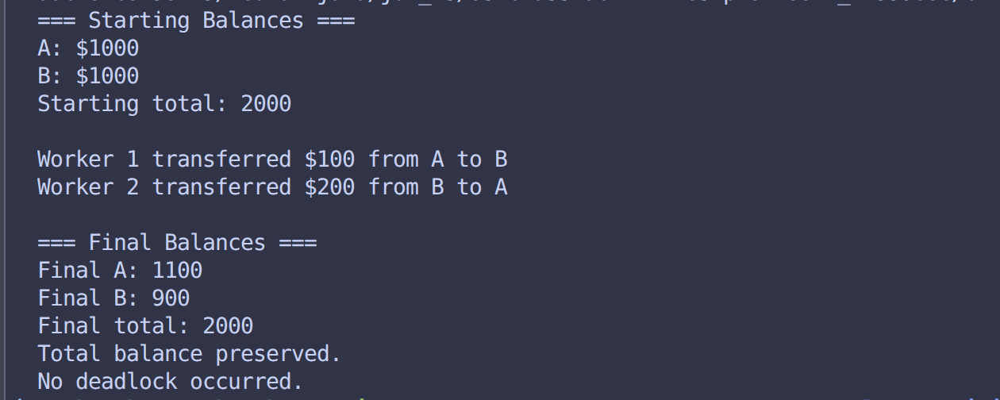

# Class Activity 6 - Deadlock Simulation

- **Student Name:** Poch Sathya
- **Student ID:** p20240012
- **Programming Language Used:** Java

---

## Task 1: Deadlock Version

- Shared resources:
- Transaction 1: 1000$
- Transaction 2: 1000$
- Deadlock message shown:
    Deadlock detected: transactions are stuck
    Thread-1 is waiting for Account-2
    Thread-2 is waiting for Account-1
- Explanation of why the program got stuck:
The program became permanently stuck because it satisfied the conditions required to create a Circular Wait deadlock.
---

## Task 2: Deadlock Prevention Version

- Prevention strategy used: Lock Ordering (Resource Hierarchy)
- Semaphore mutex initial value: 1
- Starting total: 2000$
- Final total:  2000$
- Did both transfers complete? Yes
- Why no deadlock occurred: The deadlock was prevented because the code broke the Circular Wait condition.

---

## Questions

1. What are the two shared resources in your bank transaction simulation?
The two bank accounts . Account A and Accout B.
2. Which line or section of your Task 1 program creates hold-and-wait?
    from.lock.acquire(); 
    Thread.sleep(100);   
    to.lock.acquire();
3. How does Task 1 create circular wait?
Task 1 creates a circular wait by executing two concurrent threads that request the same set of locks but in a reversed.
    Thread-1 locks Account-1 and waits to lock Account-2.
    Thread-2 locks Account-2 and waits to lock Account-1.
4. Why does the Task 1 program need a watchdog or timeout?
Task 1 program need a watchdog or timeout because without a watchdog or timeout, the program would simply freeze forever when a deadlock occurs.
5. How does the single semaphore mutex prevent deadlock in Task 2?
The single semaphore mutext prevent deadlock in Task 2 by allows only one thread to execute the transfer operation at a time.
6. Which of the four deadlock conditions does your Task 2 solution remove or avoid?
Task 2 removes the Hold and Wait condition and prevents Circular Wait from occurring.
7. Why must the final total bank balance remain unchanged after both transfers?
The final total bank balance remain unchanged after both transfers because transfers only move money between accounts. 
---

## Reflection

_What did this activity teach you about deadlock prevention in real systems such as banking, databases, or file systems?_
Deadlock Prevention in real systems such as banking , databases , or file systems
ensures a system never enters a deadlock state. It simulates resource allocation requests and determines whether granting the request would leave the system in a state where all processes can complete execution.