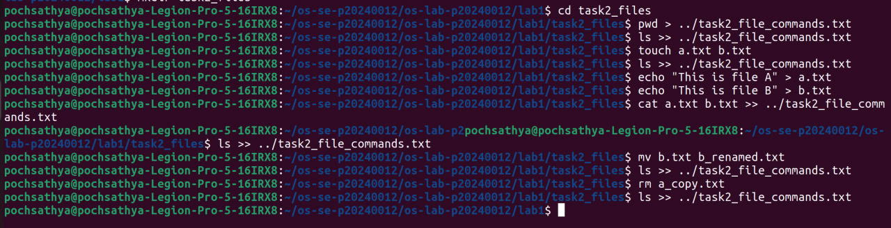
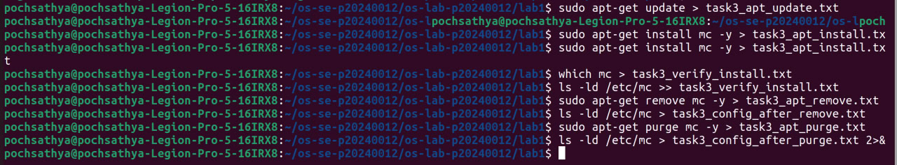
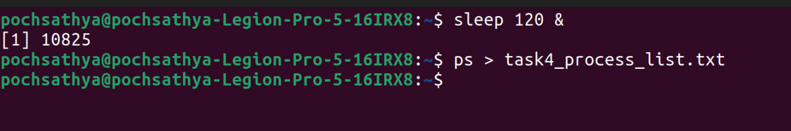
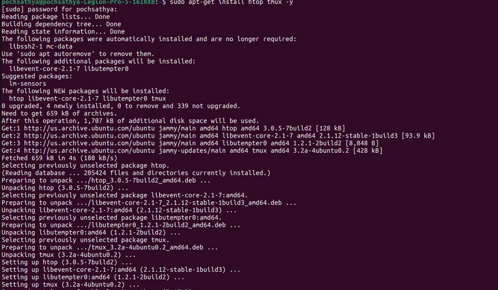
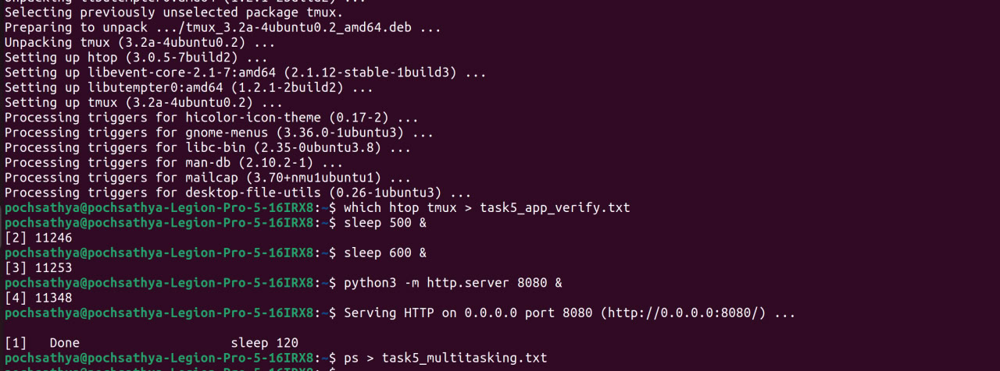
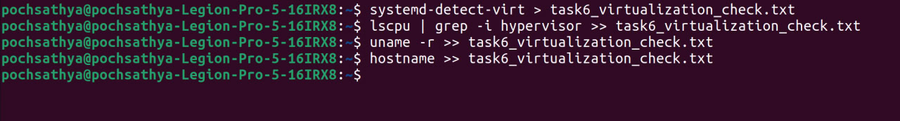

# OS Lab 1 Submission

- **Student Name:** Poch Sathya
- **Student ID:** p20240012

---

## Task 1: Operating System Identification

Briefly describe what you observed about your OS and Kernel here.

--> I saw UBUNTU version and other informations about UBUNTU such as : 
    Linux pochsathya-Legion-Pro-5-16IRX8 6.8.0-101-generic #101~22.04.1-Ubuntu SMP PREEMPT_DYNAMIC Wed Feb 11 13:19:54 UTC  x86_64 x86_64 x86_64 GNU/Linux
    Distributor ID:	Ubuntu
    Description:	Ubuntu 22.04.5 LTS
    Release:	22.04
    Codename:	jammy


---

## Task 2: Essential Linux File and Directory Commands

Briefly describe your experience creating, moving, and deleting files.

--> I practice managing and handling files through command line.



---

## Task 3: Package Management Using APT

Explain the difference you observed between `remove` and `purge`.

--> The primary difference is how they handle configuration files. `apt remove` command uninstalls the main software package but leaves its configuration files behind on the system. But, `apt purge` completely removes both the software and all the configuration files,.





---

## Task 4: Programs vs Processes (Single Process)

Briefly describe how you ran a background process and found it in the process list.

--> To run a program in the background, I appended an ampersand (`&`) to the end of the command . This allowed the command to execute without tying up the terminal. I then located it in the process list by running the `ps` command, where I could clearly identify the `sleep` process running in the background with the Process ID (PID) of 10614.





---

## Task 5: Installing Real Applications & Observing Multitasking

Briefly describe the multitasking environment and the background web server.

--> Based on the `ps` output, the system demonstrates a true multitasking environment by running multiple processes concurrently within the same terminal session (`pts/0`). 

The `python3` process (PID 12260) is running the web server in the background. Because it is running as a background task, it continuously listens for web requests without locking up the terminal. This allows the operating system to simultaneously execute other background programs .




<br></br>



---

## Task 6: Virtualization and Hypervisor Detection

State whether your system is running on a virtual machine or physical hardware based on the command outputs.

--> Based on the output 'none'.My system is running directly on physical hardware no inside a virtual machine.




```
C:.
└───os-lab-p20240019
    └───lab1
        │   README.md
        │   task1_os_info.txt
        │   task2_file_commands.txt
        │   task3_apt_install.txt
        │   task3_apt_purge.txt
        │   task3_apt_remove.txt
        │   task3_apt_update.txt
        │   task3_config_after_purge.txt
        │   task3_config_after_remove.txt
        │   task3_verify_install.txt
        │   task4_process_list.txt
        │   task5_app_verify.txt
        │   task5_multitasking.txt
        │   task6_virtualization_check.txt
        │
        ├───image
        │       task1.png
        │       task2.png
        │       task3.png
        │       task4.png
        │       task5.png
        │       task6.png
        │
        └───task2_files
                a.txt
                b_renamed.txt
```

