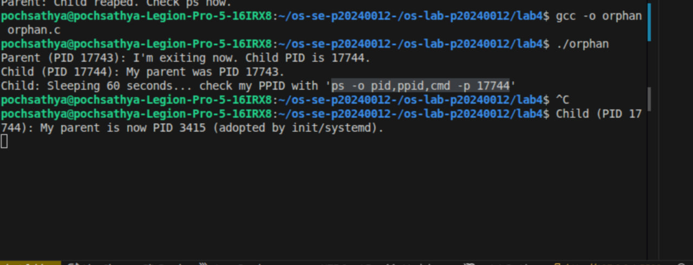

# Lab 4 — I/O Redirection, Pipelines & Process Management

| | |
|---|---|
| **Student Name** | Poch Sathya |
| **Student ID** | p20240012 |

## Task Completion

| Task | Output File | Status |
|------|-----------|--------|
| Task 1: I/O Redirection | `task1_redirection.txt` | ☐ |
| Task 2: Pipelines & Filters | `task2_pipelines.txt` | ☐ |
| Task 3: Data Analysis | `task3_analysis.txt` | ☐ |
| Task 4: Process Management | `task4_processes.txt` | ☐ |
| Task 5: Orphan & Zombie | `task5_orphan_zombie.txt` | ☐ |

## Screenshots

### Task 4 — `top` Output

### Task 4 — `htop` Tree View

### Task 5 — Orphan Process (`ps` showing PPID = 1)

### Task 5 — Zombie Process (`ps` showing state Z)

## Answers to Task 5 Questions

1. **How are orphans cleaned up?**
   > They are adopted by the init process (PID 1), which automatically calls wait() to collect their exit status and remove them from the process table.

2. **How are zombies cleaned up?**
   > The parent process must call wait() or waitpid(). If the parent fails to do this, killing the parent forces the zombie to be adopted (and cleaned up) by init.

3. **Can you kill a zombie with `kill -9`? Why or why not?**
   > No. A zombie is already dead and has no running code; it is just a process table entry. You cannot "kill" something that isn't alive to receive the signal.

## Reflection

> The most useful thing I learned was using ps auxf to see the process tree. It makes it much easier to track down which parent process is causing issues. In a real server, I’d use pipelines to quickly filter through logs for errors and use redirection to save that output into a file for later debugging.