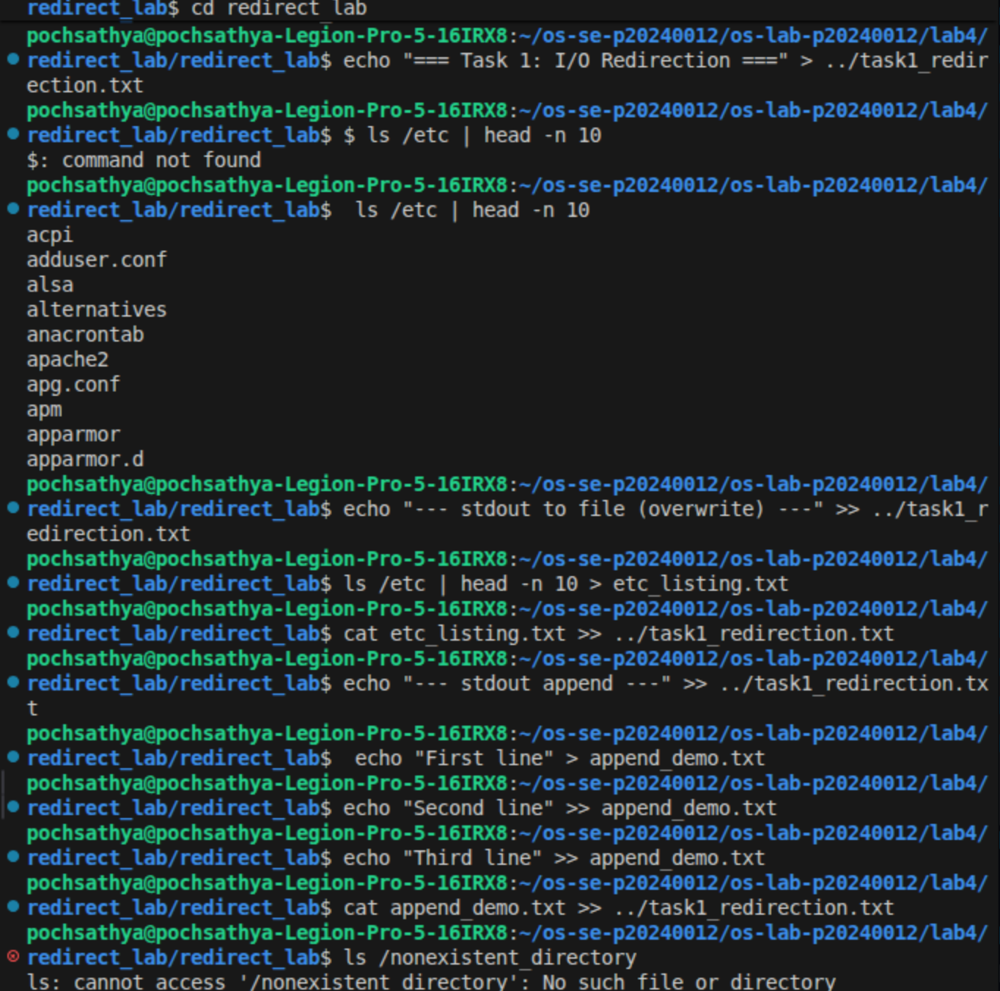
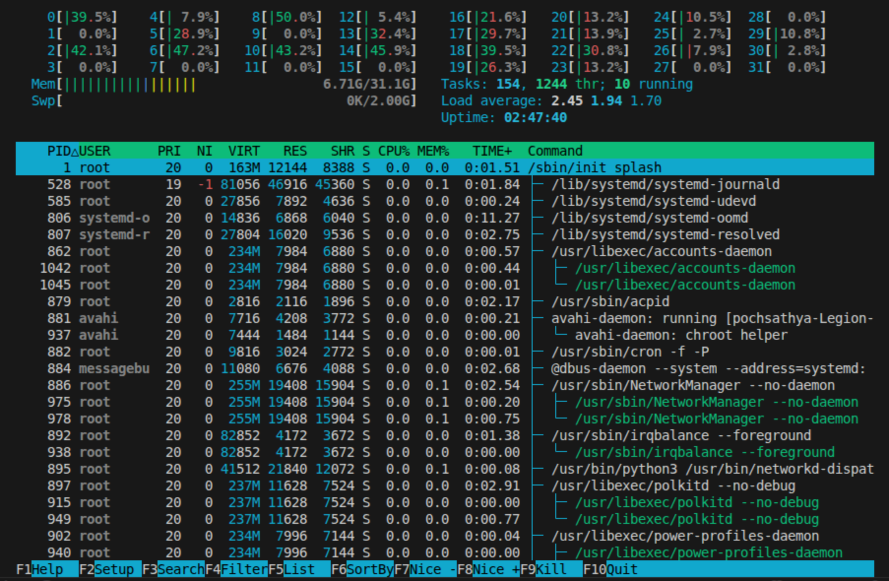

# Lab 4 — I/O Redirection, Pipelines & Process Management

| | |
|---|---|
| **Student Name** | Poch Sathya |
| **Student ID** | p20240012 |

## Task Completion

| Task | Output File | Status |
|------|-----------|--------|
| Task 1: I/O Redirection | `task1_redirection.txt` | ☐ |
| Task 2: Pipelines & Filters | `task2_pipelines.txt` | ☐ |
| Task 3: Data Analysis | `task3_analysis.txt` | ☐ |
| Task 4: Process Management | `task4_processes.txt` | ☐ |
| Task 5: Orphan & Zombie | `task5_orphan_zombie.txt` | ☐ |

## Screenshots

### Task 4 — `top` Output

### Task 4 — `htop` Tree View

### Task 5 — Orphan Process (`ps` showing PPID = 1)

### Task 5 — Zombie Process (`ps` showing state Z)

## Answers to Task 5 Questions

1. **How are orphans cleaned up?**
   > 

2. **How are zombies cleaned up?**
   > 

3. **Can you kill a zombie with `kill -9`? Why or why not?**
   > 

## Reflection

> _What was the most useful command/technique you learned in this lab? How would you use pipelines and redirection in a real server environment?_